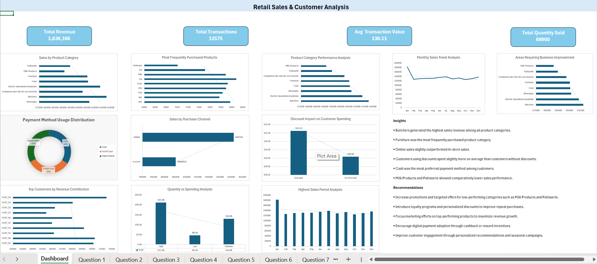

# Retail Sales & Customer Behavior Analysis Dashboard

## Project Overview

This project focuses on analyzing retail sales transactions and customer purchasing behavior using Microsoft Excel. The objective was to transform raw transactional data into meaningful business insights by performing data cleaning, feature engineering, pivot table analysis, and dashboard creation.

The dashboard provides a visual representation of customer purchasing trends, product performance, revenue contribution, payment preferences, and sales patterns to support business decision-making.

---

## Objectives

The main objectives of this project were:

- Analyze total sales performance and customer purchasing behavior
- Identify high-performing and low-performing product categories
- Understand customer payment preferences
- Evaluate the impact of discounts on customer spending
- Detect monthly sales trends and revenue patterns
- Identify top customers contributing to sales
- Generate actionable business recommendations

---

## Dataset Information

The dataset contains retail transaction records with details related to:

- Transaction ID
- Customer ID
- Product Category
- Item Name
- Price Per Unit
- Quantity Purchased
- Total Spending
- Payment Method
- Purchase Channel
- Transaction Date
- Discount Information

---

## Data Cleaning and Preprocessing

Several preprocessing steps were performed before analysis:

### Data Cleaning

- Checked for missing values
- Removed duplicate records
- Standardized category names
- Corrected inconsistent formatting
- Verified data types

### Feature Engineering

Additional columns were created for deeper analysis:

**Total Spending**

```excel
=Price Per Unit * Quantity
```

**Month**

```excel
=TEXT(Transaction Date,"mmm")
```

**Year**

```excel
=YEAR(Transaction Date)
```

**Day**

```excel
=DAY(Transaction Date)
```

**Discount Status**

```excel
=IF(Discount Applied=TRUE,"Discount","No Discount")
```

**Purchase Group**

```excel
=IF(Total Spending<100,"Low",
IF(Total Spending<=200,"Medium","High"))
```

**Quantity Group**

```excel
=IF(Quantity<4,"Low",
IF(Quantity<=7,"Medium","High"))
```

---

## Business Questions Solved

The analysis answers the following business questions:

1. What is the total revenue generated from all transactions?
2. Which product category contributes the highest sales?
3. Which products are purchased most frequently?
4. What are the top-performing and low-performing product categories?
5. Which payment method is used most by customers?
6. How do sales vary across different purchase channels?
7. Does applying discounts increase customer spending?
8. Which customers contribute the highest revenue?
9. What is the average transaction value?
10. How do monthly sales trends change over time?
11. Which time period generated the highest sales?
12. What is the relationship between quantity purchased and total spending?
13. Which business areas need improvement based on sales performance?
14. What recommendations can improve sales and customer engagement?

---

## Dashboard Components

### KPI Cards

The dashboard includes key performance indicators:

- Total Revenue: **1,636,166**
- Total Transactions: **12,575**
- Average Transaction Value: **130.11**
- Total Quantity Sold: **69,900**

---

## Dashboard Visualizations

The dashboard contains the following visualizations:

- Sales by Product Category
- Most Frequently Purchased Products
- Product Category Performance Analysis
- Monthly Sales Trend Analysis
- Payment Method Usage Distribution
- Sales by Purchase Channel
- Discount Impact on Customer Spending
- Top Customers by Revenue Contribution
- Quantity vs Spending Analysis
- Highest Sales Period Analysis
- Areas Requiring Business Improvement

---

## Key Insights

- Butchers generated the highest revenue among product categories.
- Furniture products were purchased most frequently.
- Online purchases slightly outperformed in-store purchases.
- Customers using discounts spent slightly more on average.
- Cash was the most preferred payment method.
- Milk Products and Patisserie showed comparatively lower sales performance.

---

## Business Recommendations

- Increase promotional campaigns for low-performing categories such as Milk Products and Patisserie.
- Introduce loyalty programs and personalized discounts to improve customer retention.
- Focus marketing efforts on high-performing products to maximize sales.
- Encourage digital payment adoption through cashback and reward programs.
- Improve customer engagement through personalized recommendations and seasonal campaigns.

---

## Tools Used

- Microsoft Excel
- Pivot Tables
- Pivot Charts
- KPI Cards
- Data Cleaning Techniques
- Feature Engineering
- Dashboard Design

---

## Dashboard Preview



---

## Project Structure

```
Retail-Sales-Customer-Behavior-Analysis/
│
├── Retail_Sales_Customer_Analysis.xlsb
├── retail_store_sales.csv
├── dashboard.png
├── retail_store_business_questions.txt
└── README.md
```

---

## Conclusion

This project demonstrates how Excel can be used for end-to-end business analysis by transforming raw retail transaction data into interactive dashboards and actionable insights. The findings can help businesses optimize sales strategies, understand customer behavior, and improve decision-making.
